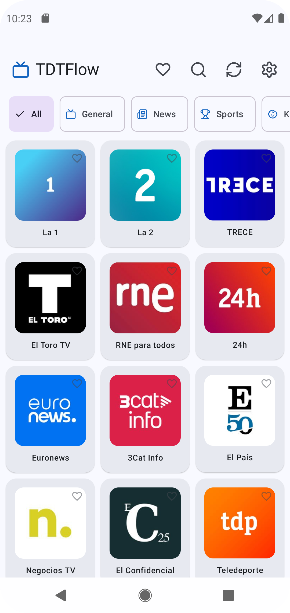
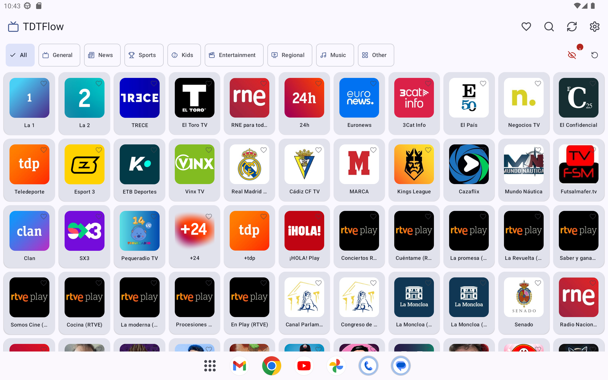
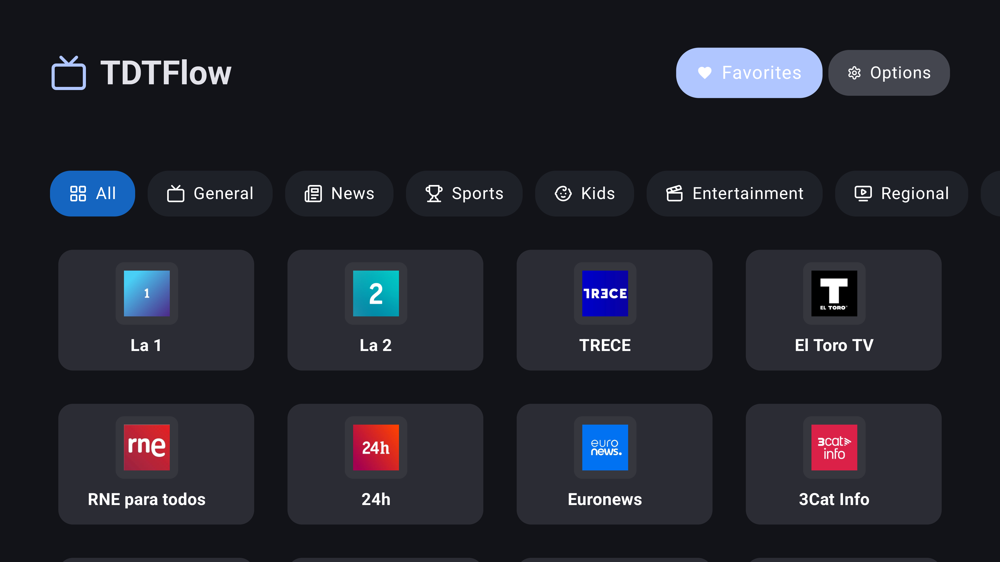

# TDTFlow — Spanish Free-to-Air TV & Radio

[](https://github.com/PedroGM80/TDTFlow/actions/workflows/ci.yml)
[](https://kotlinlang.org)
[](https://developer.android.com/build)
[](https://developer.android.com/media/media3)
[](LICENSE)
[](https://www.android.com)

**TDTFlow** is a production-quality Android app for streaming Spanish free-to-air television and radio — no account, no subscription. Built with **Jetpack Compose**, **Clean Architecture**, and **MVI**, it delivers a native, fluid experience on every Android form factor: phone, tablet, and Android TV.

---

## Screenshots

| Phone | Tablet | Android TV |
|:---:|:---:|:---:|
|  |  |  |

---

## Features

### Content & Streaming

- **100+ TDT channels** — national (La 1, La 2, 24h, Clan, Teledeporte, TRECE), regional (TV3, ETB, Canal Sur, Aragón TV, IB3…) and thematic.
- **50+ radio stations** — Cadena SER, COPE, RNE, Onda Cero, LOS40, Rock FM, Kiss FM, Europa FM, Cadena Dial, Radio Marca, regional Catalan and Andalusian stations and more.
- **HLS & MP3/AAC streaming** via AndroidX Media3 / ExoPlayer with custom HTTP timeouts and cross-protocol redirect support.
- **Background playback** — `PlaybackService` (Media3 `MediaSessionService`) keeps audio running when the app is minimised or the screen turns off, with a persistent notification and media controls.
- **Offline resilience** — 50+ hardcoded fallback channels (TV + radio) automatically used when the remote API is unreachable.

### Smart Functionality

- **8 category filters** — General, News, Sports, Kids, Entertainment, Regional, Music, Other.
- **Radio / TV visual separator** — channels are automatically classified as radio (by stream format, ambit name, or channel name) and displayed in a clearly separated section within each mixed-content category.
- **Real-time search** with 300 ms debounce to minimise recompositions.
- **Broken channel detection** — automatic marking after an 8-second buffering timeout or a playback error; counter shown in the UI with options to retry individual channels or revalidate all.
- **Persistent favourites** — stored in SharedPreferences, restored across sessions, accessible from a dedicated screen.
- **Persistent preferences** — theme (Light / Dark / System) and app language (ES / EN / CA / System) backed by DataStore.

### Multi-Platform UI

| Form factor | Layout |
|---|---|
| Phone portrait | TopAppBar · search · category chips · adaptive grid · player overlay |
| Phone landscape (playing) | Fullscreen immersive player · Aspect Ratio Fit (no cropping) · Brightness/Volume gestures |
| Phone landscape (browsing) | Fullscreen channel grid · Minimalist tap-to-reveal overlay with transparency |
| Tablet | Scaled portrait / landscape layout identical to phone |
| Android TV | TV Material 3 · Adaptive grid with centered cards · Focus glow · Scale animations |

- **Immersive mode** — system bars hidden across the entire app; swipe from edge to peek temporarily (`BEHAVIOR_SHOW_TRANSIENT_BARS_BY_SWIPE`).
- **Options panel** — accessible on every form factor: theme selector, language selector, broken channel toggle, revalidation action.

### Design

- **Material Design 3** with dynamic colour (Monet) on Android 12+.
- **Press-scale animation** on every channel card for tactile feedback.
- **Favourites badge** — circular background turns soft red when a channel is saved, ensuring the heart icon is always visible regardless of background colour.
- **Channel logos** via Coil 2; category icon fallback when no logo is available.
- **Smooth transitions** — `AnimatedContent` / `AnimatedVisibility` throughout.
- **Multilingual** — Spanish, English, Catalan (+ System default).

---

## Architecture

```
┌──────────────────────────────────────────────────────────────────┐
│  :app  (Presentation)                                            │
│  Jetpack Compose · ViewModels (MVI) · Hilt · PlaybackService     │
├──────────────────────────────────────────────────────────────────┐
│  :domain  (Business Logic — pure Kotlin/JVM, javax.inject)       │
│  UseCases · Domain Models · Repository interfaces · FilterLogic  │
├──────────────────────────────────────────────────────────────────┤
│  :data  (Data Layer)                                             │
│  Ktor · RepositoryImpl · ChannelMapper · DataStore · Fallback    │
└──────────────────────────────────────────────────────────────────┘
```

### MVI Pattern

Every ViewModel exposes a single `StateFlow<UiState>` and processes actions through `onIntent()`:

```kotlin
viewModel.onIntent(TdtIntent.SelectChannel(channel))
viewModel.onIntent(TdtIntent.FilterByCategory(ChannelCategory.SPORTS))
viewModel.onIntent(TdtIntent.Search("cope"))
viewModel.onIntent(TdtIntent.ToggleShowBrokenChannels)
```

State is composed reactively from multiple source flows using `combine()`:

```kotlin
// Channels + category + search + brokenUrls + playerState → single TdtUiState
combine(filteredChannels, playerController.currentChannel, selectedCategory, ...) { ... }
    .stateIn(viewModelScope, SharingStarted.WhileSubscribed(5_000), TdtUiState())
```

### Radio Detection

Streams are classified at the data layer using a multi-layer heuristic:

```kotlin
// 1. Ambit name (e.g. "Musicales", "Populares")
val isRadioAmbit = ambitName.contains("Music", ignoreCase = true) || ...

// 2. Channel name patterns
val isRadioName = name.contains("Radio", ignoreCase = true) || name == "LOS40" || ...

// 3. Stream format
val isRadioFormat = format == "aac" || format == "mp3"

// 4. Manual override from repository (highest priority)
val finalIsRadio = isRadioManual ?: (isRadioAmbit || isRadioName || isRadioFormat)
```

### Background Playback

```
User selects channel
  → PlayerController.selectChannel(channel)
  → TdtPlayer.play(url, channelName, channelLogo)   ← metadata for notification
  → ExoPlayer.setMediaSource() + prepare()
  → context.startService(PlaybackService)
  → MediaSession wraps ExoPlayer singleton
  → System notification with channel name + controls
  → Audio continues when app is backgrounded
```

---

## Tech Stack

| Category | Technology | Version |
|---|---|---|
| Language | Kotlin (K2 compiler) | 2.3.20 |
| Build | Android Gradle Plugin | 9.1.0 |
| UI | Jetpack Compose + Material 3 | BOM 2026.03.01 |
| TV UI | TV Material 3 | 1.1.0-rc01 |
| DI | Hilt / javax.inject | 2.59.2 / 1 |
| Media | AndroidX Media3 / ExoPlayer | 1.10.0 |
| Networking | Ktor (client + serialization) | 3.4.2 |
| Image loading | Coil | 2.7.0 |
| Serialization | Kotlinx Serialization JSON | 1.11.0 |
| Coroutines | Kotlinx Coroutines | 1.10.2 |
| Persistence | DataStore Preferences | 1.2.1 |
| Icons | Lucide Icons | 1.1.0 |
| Crash reporting | Firebase Crashlytics | BOM 34.12.0 |
| Architecture | Clean Architecture · MVI | — |
| Testing | JUnit 4 · Turbine · Coroutines Test | — |
| Coverage | JaCoCo | 0.8.12 |
| CI | GitHub Actions | — |
| Min / Target SDK | API 24 / 35 | — |

---

## Getting Started

### Prerequisites

- **Android Studio** Ladybug or newer
- **JDK 21** (required by Gradle 9 / AGP 9)
- **Android device / emulator** API 24+

### Clone & run

```bash
git clone https://github.com/PedroGM80/TDTFlow.git
cd TDTFlow
./gradlew assembleDebug          # build APK
./gradlew installDebug           # install on connected device / emulator
```

### TV

Connect an Android TV device or start an Android TV emulator (API 24+). The app auto-launches `TvActivity` when `UI_MODE_TYPE_TELEVISION` is detected.

---

## Testing & CI

```bash
./gradlew :app:test              # ViewModel, filter logic, options
./gradlew :domain:test           # UseCases
./gradlew :data:test             # Repository, mapper, cache, merge
./gradlew jacocoTestReport       # Aggregate JaCoCo XML + HTML report
./gradlew lint                   # Android Lint + Codacy analysis
```

**What's covered:**

| Module | Test files | Highlights |
|---|---|---|
| :app | `TdtViewModelTest`, `ChannelFilterLogicTest`, `OptionsMenuViewModelTest`, `FavoritesViewModelTest` | MVI intent handling, reactive state, filter combinations |
| :domain | `GetChannelsUseCaseTest`, `AddFavoriteUseCaseTest`, `RemoveFavoriteUseCaseTest`, `ChannelTest` | Use case contracts |
| :data | `ChannelRepositoryImplTest`, `ChannelMapperTest`, `FavoritesRepositoryImplTest`, `ChannelCacheTest`, `ChannelMergeTest`, `FallbackChannelsTest` | Parallel fetch, radio classification, deduplication, fallback integrity |

Test fakes (`FakeChannelsRepository`, `FakeFavoritesRepository`, `FakeBrokenChannelTracker`) and reusable fixtures (`TestChannels`) keep tests fast and deterministic.

**CI pipeline (GitHub Actions):**

```
push / PR  →  Lint (Codacy SARIF + Android lint)
           →  Unit tests + JaCoCo coverage upload
           →  Release AAB (keystore signing, master/develop/tags only)
```

---

## Project Structure

```
TDTFlow/
├── app/                        # Presentation layer
│   └── src/main/java/.../
│       ├── MainActivity.kt     # Phone entry point
│       ├── TvActivity.kt       # TV entry point (auto-launched)
│       ├── di/                 # Hilt AppModule
│       ├── navigation/         # NavGraph
│       ├── player/             # TdtPlayer, PlayerController, PlayerState
│       ├── service/            # PlaybackService (MediaSessionService)
│       └── ui/
│           ├── components/     # Shared composables (ChannelCard, LogoImage, …)
│           ├── favorites/      # FavoritesScreen + ViewModel
│           ├── mobile/         # MobileScreen (portrait / landscape / tablet)
│           ├── options/        # OptionsMenuScreen + ViewModel
│           └── tv/             # TvScreen, TvChannelBrowser, TvChannelCard
├── domain/                     # Pure Kotlin business logic
│   └── src/main/java/.../
│       ├── model/              # Channel, ChannelCategory
│       ├── repository/         # Repository interfaces
│       ├── usecase/            # GetChannels, AddFavorite, …
│       ├── tracker/            # BrokenChannelTracker interface
│       └── ChannelFilterLogic  # Filter + search algorithm
└── data/                       # Data layer
    └── src/main/java/.../
        ├── remote/             # Ktor client, TdtApi, ChannelMapper
        ├── repository/         # ChannelRepositoryImpl, FavoritesRepositoryImpl
        ├── fallback/           # FallbackChannels (100+ hardcoded)
        ├── BrokenChannelTrackerImpl
        └── OptionsDataStore
```

---

## License

MIT License — see [LICENSE](LICENSE) for details.
